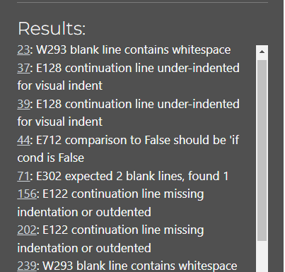

<h1>Project 3 - Blackjack</h1>
This app is based on the card game Blackjack, also known as 21’s. The aim of the game is to get a score of 21.

The game lasts 3 rounds, each round the user and dealer(computer) are dealt 2 cards. The user will then be prompted on whether they would like to Hit or Stand. The user's goal is to get a higher score than the dealer, but the card value total must not exceed 21. If the user’s/computer's total card value goes over 21, they bust and they have lost. 

<a href="https://db-project3-c5b4318d6ba5.herokuapp.com/">Link to deployed project</a>
<h2>Technologies Used</h2>
Python

<h2>Target Audience</h2>
<ul>
<li>People who enjoy card games</li> 
<li>People who are interested in learning how to play Blackjack</li>
<li>People who have played Blackjack before and want to play it again.</li>
</ul>
<h2>User stories </h2>
<ul>
  <li>As a player, I want the game to be easy to understand</li>
  <li>As a player, I want the game to be fun to play</li>
  <li>As a player, I want to have access to instructions that teach me how to play the game</li>
</ul>
<h3>Current User Goals</h3>
To allow the user to enjoy multiple rounds of Blackjack. Every round is randomised which makes it different for the user on each playthrough.
<h3>New User Goals</h3>
To learn how to play Blackjack.

<h2>Future Goals</h2>
In the future I would like to implement a betting system where the user can choose the amount they would like to bet before each round.

<h2>Features</h2>
This app will begin with displaying the game title and a welcome message and ask the user for their name. The user will also be asked if they would like to learn how to play. The choices will be either yes(Y) or no(N).
<h3>How to play</h3>
The aim of this game is to get a score of 21 or a higher score than the computer, as long as it does not go over 21. During each round the player will be given the choice to hit or stand. They can keep hitting until they are bust. If the player gets a blackjack it will result in a win, if the computer gets a blackjack it will result in a loss. If the player and computer obtain the same score, it will result in a tie.

<h2>Error Handling</h2>
If the user does not enter a correct prompt from the selection given, such as Y or N, it will prompt the user again to put in the correct information.

<h2>Testing</h2>
Validator Testing
This code was tested by using CI PEP8 Online. 

<h3>Errors Found</h3>
When I passed my code through the validator I was given a lot of warnings about whitespace. I also had a few lines of code that were too long so I had to seperate them onto a seperate line making sure to correctly indent them.

<h3>After testing</h3>
My code now passes through the validator with no errors.

<h2>Manual Testing</h2>
<h4>Elements Testing</h4>
<table>
  <thead>
    <tr>
      <th>Element</th>
      <th>Outcome</th>
      <th>Pass/Fail</th>
    </tr>
  </thead>
  <tbody>
    <tr>
      <td>Game Area</td>
      <td>Game starts as expected, prints game title, introduction. </td>
      <td>Pass</td>
    </tr>
    <tr>
      <td>Instructions</td>
      <td>Entering Y when prompted if you want to learn how to play correctly brings up the game instructions.</td>
      <td>Pass</td>
    </tr>
    <tr>
      <td>Cards</td>
      <td>Prints as expected, no duplicates and they are randomised each time.</td>
      <td>Pass</td>
    </tr>
    <tr>
      <td>Do you want to play again prompt</td>
      <td>Functions as expected. Y restarts the game and N will exit the game.</td>
      <td>Pass</td>
    </tr>
    <tr>
      <td>Hit</td>
      <td>Functions as expected. Gives the player another card.</td>
      <td>Pass</td>
    </tr>
    <tr>
      <td>Stand</td>
      <td>Functions as expected. The player is not given anymore cards and the winner is determined.</td>
      <td>Pass</td>
    </tr>
    <tr>
      <td>User Wins</td>
      <td>Functions as expected. Follows game rules</td>
      <td>Pass</td>
    </tr>
    <tr>
      <td>User Losses</td>
      <td>Functions as expected. Follows game rules.</td>
      <td>Pass</td>
    </tr>
    <tr>
      <td>Tie</td>
      <td>Functions as expected. If the computer and user have the same value, it results in a tie.</td>
      <td>Pass</td>
    </tr>
    <tr>
      <td>Name Prompt</td>
      <td>Functions as expected. People can either enter their name or choose to skip by pressing enter.</td>
      <td>Pass</td>
    </tr>
  </tbody>
</table>

<h3>Unfixed Bugs</h3>
None that I am aware of.

<h2>Frameworks, Libraries & Programs</h2>
Gitpod
GitHub
Heroku 
Random - to randomize the cards for every round of Blackjack.

<h2>Deployment</h2>
<li><ul>This app was deployed to Heroku.</ul>
<ul>After creating an account and logging in, create a new app.</ul>
<ul>Choose a name and click Create App.</ul>
<ul>In "Settings" find Config Vars and add KEY = PORT : VALUE = 8000.</ul>
<ul>Find the Deploy tab and select GitHub under the deployment method.</ul>
<ul>Select your repository you want deployed and connected to Heroku.</ul>
<ul>Click deploy</ul>
</li>

<h2>Credits</h2>
<li><ul>To learn how to create a basic blackjack game I followed the tutorial by
https://www.youtube.com/watch?v=aryte85bt_M. It helped me to understand the logic and really helped me improve my knowledge of Python. </li>
<li>I learned how to deploy this project to Heroku by following Code Institute's love sandwiches walkthrough.
</li>